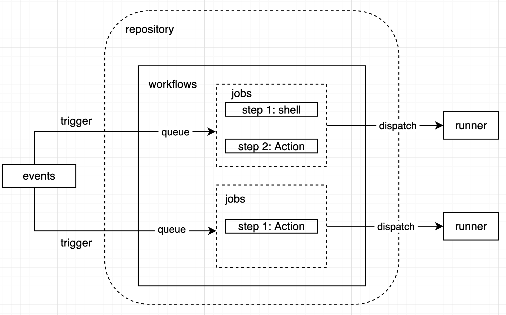

GitHub Actions is a continuous integration and continuous delivery **(CI/CD) platform** that allows you to automate your build, test, and deployment pipeline. 

GitHub Actions **goes beyond just DevOps** and lets you run workflows when other events happen in your repository.


# GitHub Actions 工作流程




Workflows

- defined by a YAML file in the `.github/workflows` directory in a repository.
- a repository can have multiple workflows, each of which can perform a different set of tasks.
- workflow contains one or more *jobs* which can run in sequential order or in parallel. 
- will run when triggered by an **event** in your repository, or they can be triggered manually, or at a defined schedule.


Events

An event is **a specific activity** in a repository that triggers a workflow run. 

Activity can originate from GitHub when someone:

- creates a pull request,
- opens an issue
- pushes a commit to a repository
- You can also trigger a workflow to run on a schedule, by posting to a REST API
- or trigger a workflow manually.

[Events that trigger workflows - GitHub Docs](https://docs.github.com/en/actions/using-workflows/events-that-trigger-workflows)


Jobs

- A job is **a set of *steps*** in a workflow.
- Each **step** is either a **shell script** that will be executed, or an ***action*** that will be run.
- Each job will run inside its own virtual machine *runner*, or inside a container.
- Since each step is executed on the same runner, you can **share data from one step to another.**
- You can configure a job's dependencies with other jobs; **by default, jobs have no dependencies and run in parallel with each other.**


Actions

- An *action* is a **custom application** that performs a **complex but frequently repeated task**. 
- It is a reusable extension that can simplify workflow.


Runners

- A runner is **a server** that runs your workflows when they're triggered. 
- Each workflow run executes in a **fresh, newly-provisioned virtual machine.**
- GitHub provides Ubuntu Linux, Microsoft Windows, and macOS runners
- If you need a different operating system or require a specific hardware configuration, you can **host your own runners**.


# Workflows 配置文件

位置：repository下的`.github/workflows/xxx.yml`，文件名自定义。

配置内容，推荐的方式是结合推荐的模板，适当修改后进行使用。

项目名称下可以看到`Actions` 的按钮，进去后可以看到推荐的各种项目类型的workflow配置文件！比如Django项目的工作流模板：

```yaml
name: Django CI (learning GitHub Actions)

on:
  push:
    branches: [ "main" ]
  pull_request:
    branches: [ "main" ]

jobs:
  build:

    runs-on: ubuntu-latest
    strategy:
      max-parallel: 4
      matrix:
        python-version: [3.7, 3.8, 3.9]

    steps:
    - uses: actions/checkout@v3
    - name: Set up Python ${{ matrix.python-version }}
      uses: actions/setup-python@v3
      with:
        python-version: ${{ matrix.python-version }}
    - name: Install Dependencies
      run: |
        python -m pip install --upgrade pip
        pip install -r requirements.txt
    - name: Run Tests
      run: |
        python manage.py test
```


重要的配置项：

- `on`  触发workflow 的方式。其他见[Workflow syntax for GitHub Actions - GitHub Docs](https://docs.github.com/en/actions/using-workflows/workflow-syntax-for-github-actions#onpushpull_requestpull_request_targetpathspaths-ignore)

    - 比如「**定时任务**」的触发方式，如下 UTC时间21点触发执行。

        ```yaml
        on:
          schedule:
            - cron: '0 21 * * *'
        ```

        

- `jobs` 所有需要运行的job

    - `runs-on` job中的配置项，表示job运行环境，即`runner`
    - `steps` job中的多个步骤，按这个顺序执行命令
        - `run` 执行shell命令
        - `uses` 使用`action`
        - `with` 使用`action`时可以携带的一些参数。不传则可以不用该配置项，即用默认的参数。


jobs的执行默认在不同queue中并行执行。

若需要jobs之前有先后依赖顺序，可以使用一些语法来控制：`if ${{}}` 以及`needs:[依赖job名]`。等等。


参考一个使用例子：[GitHub Actions 教程：定时发送天气邮件 - 阮一峰的网络日志 (ruanyifeng.com)](https://www.ruanyifeng.com/blog/2019/12/github_actions.html)

其中说道：

> 发送邮件使用的是一个已经写好的 action，只要配几个参数就可以用。参数之中，邮件 SMTP 服务器的用户名和密码，使用的是加密变量，需要在项目的`settings/secrets`菜单里面设置。

这里就指出了使用`action`的便捷之处了！另外，`secrets`变量的设置，在实际应用中也会比较常见！

# GitHub-hosted runners

[About GitHub-hosted runners - GitHub Docs](https://docs.github.com/en/actions/using-github-hosted-runners/about-github-hosted-runners)

`runner`是GitHub提供的虚拟机上的运行环境，方便用户执行`workflows`。

每个`job`，可以通过配置项`runs-on`来单独执行所运行的`runner`！目前支持的所有：[Runners](https://docs.github.com/en/actions/using-github-hosted-runners/about-github-hosted-runners#supported-runners-and-hardware-resources) 以及对应的硬件配置。


每次`Runner`在运行job的时候，都是一个新的环境！预装了`runner`应用程序和其他工具，提供了`Ubuntu Linux`、`Windows`以及`mac OS` 3种操作系统。

这些预装的软件工具，可以在`job`的setup阶段显示大 `Included Software`后的链接里看到。比如 [runner-images/Ubuntu2204-Readme.md at main · actions/runner-images (github.com)](https://github.com/actions/runner-images/blob/main/images/linux/Ubuntu2204-Readme.md)。

此外，也可以自己在`job`中的`setup`上执行命令来安装需要的软件工具。`Linux`和`mac OS`虚拟机都使用无密码sudo运行。当需要执行比更多权限的命令或安装工具时，可以使用sudo而不需要提供密码。Windows请参考官方说明。

而对于这些预装软件服务的使用，官方建议通过`action`来调用，更方便灵活，且减少一些影响使用体验的干扰！比如保证指定的工具版本不会谁软件更新而随便被改动。


关于`Github-hosted runners`所运行的云主机信息，比如硬件信息、IP信息等，可以看官方的此处说明[cloud-hosts-used-by-github-hosted-runners](https://docs.github.com/en/actions/using-github-hosted-runners/about-github-hosted-runners#cloud-hosts-used-by-github-hosted-runners)


当然，GitHub提供的虚拟机环境可能不满足自己项目的需求，那么也提供了使用自己服务器的方案。[About self-hosted runners - GitHub Docs](https://docs.github.com/en/actions/hosting-your-own-runners/about-self-hosted-runners)


（待完善）


